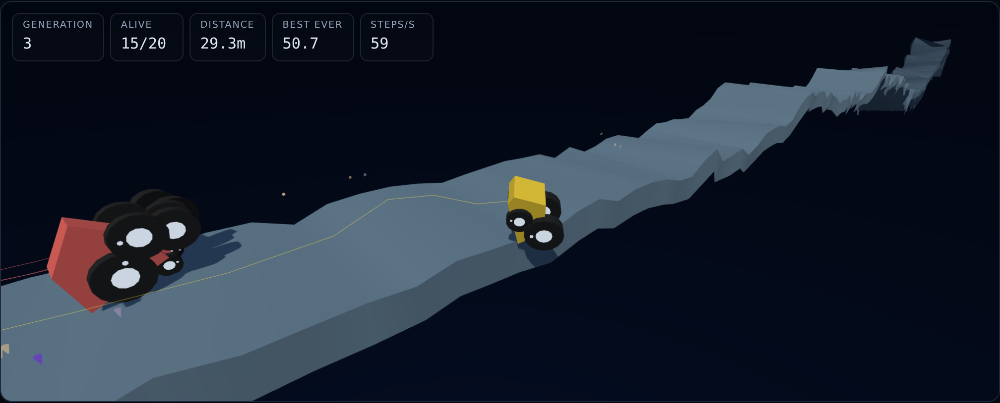
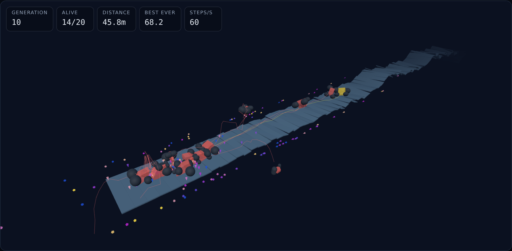

# BoxCar3D

Cars that evolve their shape and the little neural network that drives them, on
Erin Catto's Box3D physics, in a browser tab. Design a track, share the code,
and every browser driving it becomes an island in one distributed search.



Twenty random cars set off down a road that gets steeper, starts to bank, and
has holes in it. A car scores by how far it gets, plus a bonus for average
speed. It dies when it stops earning ground, rolls off the edge, or falls into a
gap. When the round is over the best ones get paired up, their genes spliced
together and lightly mutated, and the next twenty set off. Do that for a while
and something that can actually climb the hill falls out of it.

Three things make it more than a screensaver:

- **The track is a design, not a dice roll.** Length, hills, ramps, gaps,
  camber and road width, packed into a twenty character code. Paste someone
  yours and they drive the same course, hole for hole. Seven built-in tracks
  come with it, each isolating a different problem.
- **There is something to win.** Medals are fractions of the course, so gold
  means the same thing on a brutal track and a gentle one, and the author medal
  means a car actually finished. A genetic algorithm with no finish line is why
  watching one goes slack after five minutes.
- **The search is shared.** Everyone on the same track code lands in the same
  room, and champions migrate between their populations over WebRTC. No server.
- **There is a ghost to beat.** The fastest run on the track replays alongside
  the living pack, and in a room it is whoever is actually fastest anywhere.

## The tracks

The original had one kind of terrain, which quietly limits what you can ask.
You cannot find out whether a car built for hills also clears a gap, because
there is no track that is all gaps. Six knobs fix that, and the seven built-in
tracks are there because a list of things to try is a better opening than a
blank set of sliders.

| Track | What it asks |
| ----- | ------------ |
| First Light | Gentle and short. Almost anything with two wheels finishes. |
| The Climb | The original course. No tricks, just ground that keeps getting worse. |
| Leap Of Faith | Holes everywhere. Speed and a long wheelbase, or nothing. |
| Launch Pad | Ramp after ramp. Cars that survive the landings win. |
| Tightrope | Narrow and heavily cambered. Wide and low, or over the edge. |
| The Long Haul | Six hundred tiles. Nothing here is hard; finishing it is. |
| Everything At Once | Steep, gapped, ramped, narrow, banked. Probably unfinishable. |

Put the same population on Leap Of Faith and on Tightrope and two completely
different body plans win, which is the thing the single-terrain version could
never show you.

Medals are fractions of the course, so they mean the same thing everywhere and
the campaign is what supplies the difficulty curve. Taking the benchmark numbers
below at face value, a good 30 generation run reaches about 165m in 2D and about
80m in 3D. On First Light, 90 tiles and 135m, that is a finish in 2D and silver
in 3D. On The Climb, 200 tiles and 300m, it is silver in 2D and bronze in 3D,
with gold a genuine long-run target. On The Long Haul nothing has come close,
which is the idea.

Tightrope is the one that needed measuring rather than guessing: at its
settings a population reaches 30.6m against 50.5m for a gentler version of the
same course, so it is about twice as hard and still not a wall.

Gaps are real in both modes: no collider, no faces, a hole you fall into. A gap
tile keeps its geometry so the surface polyline stays a function of x and every
lookup that walks it still works, it simply has nothing to drive on. Ramps and
gaps draw from a random stream of their own, so moving the hills slider changes
the hills and leaves the features where they were.

Codes are lossless by construction. The first attempt quantised each knob to a
byte, and the test that caught it is the one that matters: whoever pastes your
code has to get the track you were driving, not one that rounds to nearby. Knobs
are stored as their slider step index instead, and specs are snapped to that
grid on the way in, so there is no representable value a code cannot hold.

## Islands

The interesting thing about running a genetic algorithm in a tab is also its
limit: your population is alone. It climbs one hill, settles into one local
optimum, and the only way out is patience or a restart. Somebody else's tab is
meanwhile stuck somewhere completely different, holding the answer you needed.

So the rooms connect them. At the end of each generation every tab offers its
champion to the room and takes one back, filling a few of its twenty slots with
cars it did not breed. That is the island model out of the distributed genetic
algorithm literature, with browsers as the islands and WebRTC as the sea. A
migrant lands with a lineage of its own, so **Colour by family** shows a foreign
line arriving fully formed and then taking hold or dying out.

[Trystero](https://github.com/dmotz/trystero) does the introductions over public
relays and everything after that is peer to peer. There is no server, nothing is
stored, and nobody's cars pass through a machine we own. It is a separate 22 kB
chunk fetched only if you join, and joining is always a button: announcing you
to strangers on public infrastructure because you opened a page is not a thing
to do to a person.

Nothing off the network is trusted. A genome goes straight into a physics
engine, so every field is checked against the same ranges the mutation operator
clamps to, and anything failing is dropped rather than repaired. A peer sending
ten thousand wheels, a NaN spoke, two wheels on one corner or a chassis a
kilometre wide costs you nothing. `tests/wire.test.ts` is nineteen tests of
exactly that, running the messages through JSON first the way the transport
does.

Laps cross the room as well as cars. The best run in 3D is recorded and replays
as a pale ghost driving beside the pack, and when a peer beats the track their
lap arrives and takes over the ghost, so what you are racing is the best anyone
in the room has managed rather than the best you have. That is the borrowed
Trackmania idea and it is why the medal bar has something to push against: a
chart says the number went up, a ghost is a line pulling away from you.

The frames go over as raw bytes with the car alongside as metadata, because a
Float32Array through JSON is most of a megabyte of decimal digits for what is a
hundred kilobytes of buffer. Broadcasts are rate limited to one every twenty
seconds, since early generations beat each other faster than a ghost can be
useful, and a suppressed one goes out on the next sweep rather than being lost.
An adopted ghost is never passed on: whoever drove it is already telling the
room, and forwarding would put the same lap round the room under everyone's name
in turn.

Bytes are as untrusted as genomes. `tests/ghostwire.test.ts` sends a real
recorded run between two real rooms and checks it arrives identical, then feeds
the reader a buffer whose length disagrees with its header, a NaN pose, a
position a thousand kilometres off the track, and a rotation that is inside the
per-component range but is not a unit quaternion and would therefore have three
scaled the whole car by its length. All of them are dropped.

The migration seam is a function rather than a socket, so the island model is
tested offline and deterministically: migrants land after the elites so they
compete rather than being culled first, and asking for migrants with nobody
connected leaves the local search unchanged bit for bit.

`tests/islands.test.ts` is the one that tests the actual claim. Two real rooms
are wired to each other through a fake socket, and two real populations trade
through them: a car bred in one turns up driving in the other, byte for byte
the same genome after a round trip through JSON and validation, holding a
lineage number that no local family shares. What is *not* covered is the
transport itself, since every relay is blocked on the network this was built
on. That is also why the room notices a blocked relay and says so rather than
sitting on "Connected" in a room that will always be empty.

## Where this came from

This began as [rednuht's Genetic Cars](http://rednuht.org/genetic_cars_2/), a
2011 page that was itself a take on BoxCar2D. It was a lovely, simple thing:
throw random two wheeled shapes at a hill, keep the ones that get furthest,
breed them, watch a car appear out of nothing. The code had not been touched
since 2013. It was one 1,119 line file of globals running on a Flash era port of
Box2D, with `Math.random` monkey patched, two `setInterval` timers that drifted
apart, a fixed 800x400 layout, and DOM writes on every physics step.

BoxCar3D is a rebuild of that idea. Five things are genuinely different:

1. **It is 3D.** Cars run on [Box3D](https://github.com/erincatto/box3d), Erin
   Catto's newer engine and a direct descendant of the Box2D the original used,
   via [box3d-wasm](https://github.com/monteslu/box3d-wasm). The road banks from
   side to side, so a car can roll off the edge rather than only ever getting
   stuck.
2. **Cars have a driver.** Each one carries a small neural network that reads
   how the car is sitting and moving and sets the speed of each wheel. Its
   weights are genes like any other.
3. **The body is far more variable.** Corners rotate as well as stretch, a car
   carries two to four wheels rather than exactly two, and chassis density is a
   gene. Measured, this is what actually improves the cars.
4. **You can watch the search, not just the run.** There is a live view of the
   winning car's network, a heatmap of the whole population's weights, and a
   graveyard of every car that has ever died on this course.
5. **Tracks are designed and shared, and searches are shared too.** The original
   had one kind of terrain and a random seed, so you could never ask whether a
   car built for hills could also clear a gap. Now you can build that track,
   send someone the code, and race their population against yours.

The original 2D game is still here under the **2D** button, rebuilt on
[planck.js](https://piqnt.com/planck.js/). Both modes share the seed, the
population controls and the genetic algorithm itself. Records are kept apart,
because a flat car and a four wheeled one are solving different problems on
different scales.

## The driver

In the original a wheel spun at one fixed speed forever. A car was a shape and
nothing else, and the whole search was "what silhouette survives being dragged
over a hill".

Now every car also has a network. It sees eight things:

| Input   | What it is                                  |
| ------- | ------------------------------------------- |
| `pitch` | nose up or nose down                        |
| `roll`  | leaning left or right, and always 0 in 2D   |
| `speed` | how fast it is going along the course       |
| `drop`  | how fast it is falling                      |
| `spin`  | how fast the body is tumbling               |
| `near`  | how steeply the ground rises 1.5 m ahead    |
| `mid`   | the same 4 m ahead                          |
| `far`   | the same 9 m ahead                          |

Those feed five hidden units, which feed one output per wheel. Each output sets
that wheel's speed somewhere between a dead stop and half again the base speed,
so a car can ease off before a crest, dig in on a climb, or back off a touch to
get a run at something.

The hidden units also see what all five of them did on the previous step. That
one loop is the whole of the network's memory, and it is what separates a driver
from a reflex: without it a car cannot tell "rocking against a rock for the last
second" from "about to crest a rise", because both look identical in a single
frame.

Three lookaheads rather than one for a similar reason. A single sample is the
gradient the car is already on, so it can only react. A wall at `far` with flat
ground at `near` is a run-up; the same wall at `near` is a problem now.

That comes to 94 weights, one output per wheel slot. Small on purpose: it fits on screen, it runs twenty
times per physics step without showing up in a profile, and it is enough to be
interesting without needing anything cleverer than a genetic algorithm to train
it.

Weights mutate differently from body genes. A body gene is resampled inside a
window, and at the default mutation size of 100% that window is the whole range,
so a mutated gene is simply re-rolled. That is fine for "how long is this strut",
where one value is as good a guess as another. It is wrong for a network weight,
where a working driver is a particular combination and re-rolling one member of
it at random destroys the thing. So weights creep: a Gaussian nudge around the
value they already have.

The **Driver** panel draws it live for whichever car the camera is on. Green
edges push, red ones hold back, thickness is the size of the weight, and
brightness is how much signal is actually flowing through it right now. Watch
one car through a hard climb and you can see which senses it leans on. The edges
out of a sense nothing depends on fade away over a few generations.

Under it, **Gene pool** is one row per car and one column per weight, coloured
by value. Generation one is noise. Leave it running and columns start to agree,
which is selection fixing a weight because every car that survived happens to
share it. Bands that stay noisy are weights nothing depends on. The fitness
chart tells you the search is working; this tells you where.

## The body

The original's car was one shape with different numbers in it. Eight corners
pinned to fixed compass directions, evolving only their distance from the
centre, and four of those eight were pinned to an axis so they had one free
number rather than two. Exactly two wheels. One chassis density shared by every
car ever built. So the search could stretch that octagon but never leave it.

Three things are genes here that were constants there:

- **Corners can rotate as well as stretch.** Each is a polar pair, an angle and
  a length, and the angle can swing within its own sector. Corners therefore
  stay in order, which is what keeps the fan of triangles the chassis is built
  from convex, but wedges, slivers and long snouts are now describable.
- **Two to four wheels.** Wheel count is a gene. Gaining or losing one is the
  most disruptive single mutation available, so like wheel placement it is
  throttled by the mutation size as well as the rate. Torque is shared out
  across however many wheels there are, so a fourth buys grip rather than free
  power. In 3D every wheel is a mirrored pair, so a four wheeled silhouette runs
  on eight.
- **Chassis density.** Where the mass sits relative to the wheels is now
  something evolution can choose.

## Knobs

Everything under **Selection** in the sidebar changes the character of a run,
and most of it changes it more than any single gene does.

| Control | What it does |
| ------- | ------------ |
| Selected for | Distance, distance and speed, air time, or distance per kilo. Air time breeds jumpers; distance per kilo breeds flimsy things that would fall apart under any other rule. |
| Parents chosen by | Rank, tournament of three, or roulette. Tournament by default, because it measured better. |
| Breeding | Two point, uniform, or asexual. Asexual turns the whole thing into a mutation-only search, which is worth watching next to the others. |
| Diversity pressure | Divides a car's fitness by how crowded its corner of the search space is. |
| Fresh blood | Random newcomers each generation, replacing the worst children. |
| Migrants | Slots filled by other people's champions instead of your own breeding, once you are in a room. |

**Colour by family** under View gives every car the colour of the line it
descends from. With diversity pressure at zero you can watch one family take
the whole screen within a dozen generations. Turn the pressure up and several
hold on, which is the whole point of it.

A note on the selection methods, because the obvious guess is wrong. Exponential
rank selection sounds like the greedy one, and it is in fact the gentlest of the
three: with twenty cars it picks a top five parent about a third of the time. A
tournament of three does so more than half the time, because taking the best of
three random draws is a harsher filter than an exponential spread over the whole
field. Roulette sits between them right up until one car runs away with the
scores, and then it collapses very fast. `tests/ga.test.ts` measures all three
and pins the ordering.

Measured over 12 runs, tournament reaches 171.3m against rank's 165.0m, and a
population mean of 148.1 against 142.1, so it is now the default. Rank selection
is gentler per draw but concentrates parenthood harder over a run, and the
search loses the weaker lines that were going somewhere.

## Does any of it actually drive further?

This is worth measuring rather than assuming, and the answer is interesting: the
driver barely matters and the body matters a lot.

Every number below came from `npm run bench`, which is in the repository so the
claims are reproducible and so the next change can be judged the same way. Each
row is 12 runs (6 track seeds by 2 population seeds), 30 generations in 2D and
20 in 3D, reporting how far the furthest car got. `best` is the peak across
all generations, `mean` the average across them, which is the better measure of
whether the whole population improved rather than one lucky car.

| Configuration                          | 2D best | 2D mean | 3D best | 3D mean |
| -------------------------------------- | ------- | ------- | ------- | ------- |
| Reflex driver, fixed body (as inherited) |   156.3 |   125.4 |    72.3 |    47.2 |
| Memory driver, fixed body               |   158.9 |   123.6 |    73.5 |    47.5 |
| Memory driver, variable body            |   165.0 |   142.1 |    79.8 |    53.1 |

Making the driver cleverer bought almost nothing: a couple of metres on peak
distance, inside the noise, and nothing at all on the mean. Making the body more
variable moved every column, and moved the mean by 15% in 2D and 12% in 3D. A
controller that can only vary wheel speed cannot steer, shift weight or change
gearing, so there was never much headroom in it. Being able to grow a third
wheel or grind a corner into a wedge is a different kind of freedom.

Three more measurements, since they point the same way:

- **Making the network bigger made it worse.** At 8 hidden units instead of 5,
  2D best fell from 158.9 to 151.1. A population of 20 cars cannot explore a
  search space that wide in the generations anyone will sit through, so the
  hidden layer stayed at 5.
- **Giving the driver more authority helped in 2D and hurt in 3D.** Letting an
  output command real reverse, so a car can back up and take another run at an
  obstacle, took 2D best from 158.9 to 163.6, the largest gain any change to the
  driver produced. The same change took 3D best from 73.5 down to 68.1, because
  reversing near a banked edge is how a car falls off, and falling off is
  instant death where grinding to a halt is merely slow. 3D is the mode this
  opens in, so reverse is not shipped.
- **The extra wheels are not free.** Headless throughput fell from 1799 to 1064
  steps per second in 2D and from 1066 to 903 in 3D (both measured before the
  solver change below), since a car can now carry
  twice the bodies it used to. Worth it for the distances above, but it is why
  max mode covers less ground per second than it did.

What the driver is *allowed to do* matters more than how much network there is
to decide it with, and what the body is allowed to *be* matters more than
either.

### The cars were coming apart

Reported from a phone as cars flying through the air. They were not jumping,
they were disintegrating. Box3D's revolute joint is a soft constraint, and at
four sub-steps a hard landing produces a contact impulse it cannot hold: over
20 generations on three seeds a wheel reached 28.7 metres from its chassis,
against a legitimate reach of about 2.5, and stayed detached for up to half a
second. That is long enough to watch a car explode and reassemble.

Eight sub-steps cuts the broken frames five to nine fold, from 1.26% of
wheel-frames to 0.14% on the worst seed, and roughly halves the peak stretch.
It costs real throughput: 1954 steps per second down to 1174 on the same
machine, so max mode covers about 40% less ground per second than it did. Worth
it, since 3D is what the page opens in and the camera follows the leader, which
is the car hitting things hardest.

Two things measured and ruled out on the way, recorded so nobody repeats the
work. Flight is bounded: over 40 generations the highest anything reached was
14.4 metres above the road, and lateral position tops out at exactly the
fall-off limit, so that check fires correctly. And motor torque is not what
tears the joint, though the torque formula was wrong anyway. Force at the
contact patch is torque over radius, so the budget has to scale *with* radius;
it divided by radius instead and handed a 0.2 metre wheel 5248 newton-metres,
far past anything a tyre could transmit. Fixing it left the joints exactly as
they were and made the best car go further on all three seeds tried.

## The 3D mode

A 3D car is the 2D silhouette given a width. The chassis outline is extruded
into a convex hull and each wheel becomes a mirrored pair, so a car evolved in
2D is still a valid car here and a four wheeled silhouette runs on eight. That
adds two genes, how wide the body is and how far the wheels sit outboard, and
one new way to fail. Narrow and tall wins the early flat ground, and something
wider usually has to evolve to survive the camber.

Wheels are real wheels: sixteen sided prisms about the axle, so a tyre has a
flat tread and a contact patch that grips. They started as capsules, which on a
large radius are geometrically spheres. They looked wrong and behaved wrong,
rolling sideways instead of tracking. Tread width now scales with radius.

The road is one continuous ribbon stitched from a cross section per joint, drawn
from the same samples the physics colliders are built from, with bars painted
across it every ten metres so there is something to measure speed against.
Lighting is ACES filmic tone mapped and each car takes a slightly different hue,
so you can follow one through the pack.

### Seeing the search



Every car leaves a marker where it died, kept across every generation. Bright
ones are recent, faded blue ones are ancient history, and a tilted marker means
the car went over the edge rather than grinding to a halt. Drag to orbit, scroll
to zoom, or hit **Survey the graveyard** to pull back and look down the course.

What you get is a map of the problem rather than of one attempt. Deaths pile up
in dense bands at the obstacles the population cannot yet pass, thin out behind
the frontier as evolution solves them, and spray off both edges wherever the
camber is steep enough to throw a car off. Motion trails show the current
generation fanning out over the same ground.

All the markers are a single `InstancedMesh`, so several thousand of them cost
one draw call, and they are recoloured once per generation rather than per
frame.

## Running it

```sh
npm install
npm run dev
```

| Command             | What it does                                  |
| ------------------- | --------------------------------------------- |
| `npm run dev`       | Development server with hot reload            |
| `npm run build`     | Production build into `dist/`                 |
| `npm run preview`   | Serve the production build                    |
| `npm run typecheck` | TypeScript, no emit                           |
| `npm test`          | Unit tests for the GA, terrain and simulation |
| `npm run test:e2e`  | Playwright smoke tests against the built app  |
| `npm run bench`     | A/B sweep over configurations of the search    |

The end-to-end tests download their own Chromium by default. To reuse one that
is already installed, set `CHROMIUM_PATH` to the binary.

## Deploying

The build is a self contained static site, so any static host will serve it.
There is no server side. `vercel.json` configures Vercel directly: import the
repository and it builds with `npm run build` and serves `dist/`.

It sets two caching rules. Everything under `/assets/` carries a content hash in
its filename, so it is cached for a year and marked immutable. The entry
document is not, and must always be revalidated, since a cached `index.html`
would otherwise keep pointing at asset filenames from an older deployment.
Vercel's config schema rejects unknown keys, so those rules cannot be commented
in place, hence this note.

Two things worth knowing if you host it elsewhere. Vite is configured with a
relative `base`, so the site works from a subdirectory as well as from a domain
root. And the 3D mode uses the single threaded Box3D build deliberately, so it
needs no `SharedArrayBuffer` and therefore no cross origin isolation headers. It
will run from a plain file host.

## How the code is organised

The physics engine is kept behind a boundary. The simulation fills a plain
snapshot of positions, angles and activations, and the renderer draws from that,
so nothing outside `src/sim*/` refers to an engine and the genetic algorithm is
pure functions over plain data that can be tested without a browser.

Evolution is generic over the genome. `ga/evolution.ts` takes a `GenomeOps`
describing how to create, breed and mutate one kind of car, so both modes share
a single implementation of selection, crossover and elitism.

```
src/
  config.ts        every tunable constant, with the real ranges documented
  core/rng.ts      seedable generator (no global Math.random patching)
  ga/              genomes, the driver network, and evolution: all pure
  track/spec.ts    a track as knobs, and the code format that carries them
  net/             the wire format and its validation, and the peer room
  sim/             2D terrain, car construction, the world and its rules
  sim3d/           the same on Box3D, with a banked road and four wheels
  replay/          compact pose recording and the ghosts, flat and 3D
  render/          camera, main view, minimap, fitness chart, driver panels
  render3d/        the three.js scene
  ui/              controls, readouts, hall of fame, persistence
  app/             the fixed timestep loop and the wiring between all of it
```

Box3D, three.js and Trystero are all dynamically imported, so the flat mode
never downloads the 3D engine and a tab that never joins a room never downloads
the transport or touches a relay. Opening in 3D means waiting for that once,
behind a banner, which is why the first second or two of a fresh load shows an
empty stage.

Networking touches nothing else. `Simulation.migrantSource` is a function
returning a genome or null, so the simulation knows nothing about peers and the
island model is tested without a socket in sight.

## What changed from the original

The original single file version is preserved in this repository's git history.

- **Physics** moved from a vendored Box2DFlash 2.1a build to planck.js in 2D and
  Box3D in 3D, and solver iterations dropped from 20/20 to Box2D's 8/3 defaults.
- **One `requestAnimationFrame` loop** on a fixed timestep replaces two
  independent `setInterval` timers that drifted apart and got throttled to a
  crawl in background tabs. Speed runs from 0.5x up to a max mode that spends a
  fixed slice of each frame on physics, so evolution races ahead while the page
  stays responsive.
- **No DOM writes during physics.** The original rewrote inline styles on forty
  elements and two `innerHTML` strings every step. Canvases and readouts now
  refresh once per animation frame.
- **Replays store nine floats per frame** instead of a full geometry snapshot of
  every car on every frame.
- **The interface** was rebuilt responsively with device pixel ratio aware
  canvases, replacing a fixed 800x400 layout positioned with absolute pixel
  offsets.
- **Tracks are designed rather than seeded**, and shared as codes. The original
  had one terrain shape and a random number.
- **Populations can be connected**, so a search is no longer confined to the tab
  it started in.
- Dead Google Analytics, a PayPal form and an HTTP only widget were removed.

Bugs fixed along the way: leader tracking aliased a live physics vector, and the
function meant to recompute it never updated its own accumulator; a cached "last
drawn tile" index was never reset, so the ground vanished at the start of each
generation; the fitness graph plotted raw scores as pixel coordinates and went
off canvas above 200; mutation and crossover could both seat both wheels on the
same chassis vertex, producing cars that could not drive; and the tilt formula
reached 129 degrees on late tiles, folding the track back over itself so the
surface was no longer a function of x. Tilt is now clamped just under a quarter
turn.

### Cars that would not die

A car creeping forward at a millimetre a second used to be immortal. Any gain
over two centimetres refilled its health bar completely, so a single crawler
could hold a generation open indefinitely. Health is now earned in proportion to
ground gained, which sets a minimum sustained speed, and a generation has a hard
ninety second cap.

That was not enough on its own. A car can keep clearing a per car speed bar
while contributing nothing, rocking against an obstacle or trickling along
ground the population passed generations ago. In 3D the first generation still
ran the full cap with its last real progress made at nine seconds. So a round
now also ends when the population as a whole stops getting anywhere: six seconds
with nobody beating the round's furthest point closes it. Wasted rounds went
from ninety seconds to eleven, and four generations of 3D from 217 seconds to
50. Rounds that are still making progress are untouched, which
`tests/stall.test.ts` pins down from both sides.

Two behavioural notes: the physics feel is close but not identical, since the
solver differs, and track seeds are not compatible with the original, which used
seedrandom's RC4 generator.

## Licence

The original code carries no licence, so it remains the property of its authors.
This rebuild is published in the same spirit. Please credit
[rednuht](http://rednuht.org/genetic_cars_2/) if you build on it.
