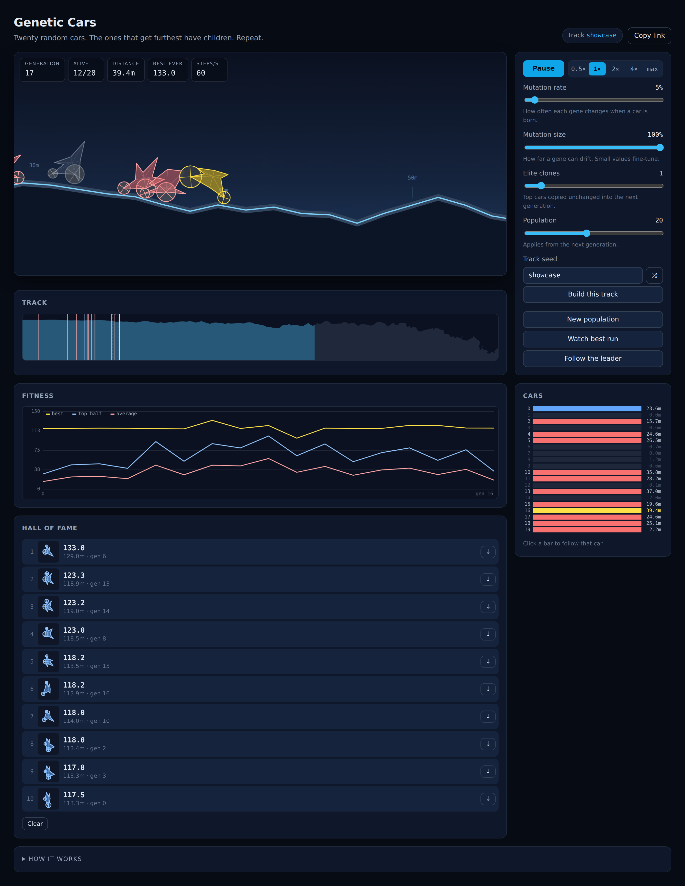

# Genetic Cars

A genetic algorithm evolves two-wheeled cars to cross procedurally generated
terrain, simulated with Box2D physics and drawn on a canvas.



Twenty random cars set off. Each one is described by fourteen numbers: eight
lengths that shape its chassis, plus the radius, density and mounting point of
each of its two wheels. A car scores by how far right it travels, with a bonus
for average speed, and dies once it has gone ten seconds without progress. When
the whole generation has died, the best cars are paired up, their genes spliced
together and lightly mutated, and the next generation sets off.

Terrain gets steeper the further you go, and is built from a track seed — the
same seed always generates the same course, so runs can be compared and shared
via the URL.

## 3D mode


Switch to 3D and the same evolution runs on
[Box3D](https://github.com/erincatto/box3d) — Erin Catto's 3D engine, the
descendant of the Box2D the original was built on — via
[box3d-wasm](https://github.com/monteslu/box3d-wasm).

A 3D car is the same silhouette given a width: the chassis outline is extruded
into a convex hull and each wheel becomes a pair, so a 2D genome is still a
valid car. That adds two genes — how wide the body is, and how far the wheels
sit outboard — and one new way to fail. The road banks from side to side, more
so the further along it goes, and a car that rolls off the edge is finished
where a 2D car would simply have kept grinding forward. Narrow and tall wins
the early flat ground; something wider usually has to evolve to survive the
camber.

Both modes share the seed, the population controls and the genetic algorithm
itself, so you can watch the same course punish different shapes. Box3D and
three.js are only downloaded when you first switch to 3D.

### Seeing the search


A single run is forgettable; the interesting object is the search. So the 3D
view keeps a marker wherever a car died, across every generation — bright ones
are recent, faded blue ones are ancient history, and a tilted marker means the
car went over the edge rather than grinding to a halt. Drag to orbit, scroll to
zoom, or hit **Survey the graveyard** to pull back and look down the course.

What you get is a map of the problem rather than of one attempt. Deaths pile up
in dense bands at the obstacles the population cannot yet pass, thin out behind
the frontier as evolution solves them, and spray off both edges wherever the
camber is steep enough to throw a car off. Motion trails show the current
generation fanning out over the same ground.

All the markers are a single `InstancedMesh`, so several thousand of them cost
one draw call; they are recoloured once per generation rather than per frame.

## Running it

```sh
npm install
npm run dev
```

| Command             | What it does                                  |
| ------------------- | --------------------------------------------- |
| `npm run dev`       | Development server with hot reload             |
| `npm run build`     | Production build into `dist/`                  |
| `npm run preview`   | Serve the production build                     |
| `npm run typecheck` | TypeScript, no emit                            |
| `npm test`          | Unit tests for the GA, terrain and simulation  |
| `npm run test:e2e`  | Playwright smoke tests against the built app   |

The end-to-end tests download their own Chromium by default. To reuse one that
is already installed, set `CHROMIUM_PATH` to the binary.

## Deploying

The build is a self-contained static site, so any static host will serve it —
there is no server side. `vercel.json` configures Vercel directly: import the
repository and it builds with `npm run build` and serves `dist/`.

It sets two caching rules. Everything under `/assets/` carries a content hash
in its filename, so it is cached for a year and marked immutable. The entry
document is not, and must always be revalidated — a cached `index.html` would
otherwise keep pointing at asset filenames from an older deployment. (Vercel's
config schema rejects unknown keys, so those rules cannot be commented in
place; hence this note.)

Two things worth knowing if you host it elsewhere. Vite is configured with a
relative `base`, so the site works from a subdirectory as well as from a domain
root. And the 3D mode uses the single-threaded Box3D build deliberately, so it
needs no `SharedArrayBuffer` and therefore no cross-origin isolation headers —
it will run from a plain file host.

## How the code is organised

The physics engine is kept behind a boundary: the simulation fills a plain
`WorldSnapshot` of positions and angles, and the renderer draws from that. So
nothing outside `src/sim/` refers to the engine, and the genetic algorithm is
pure functions over plain data that can be tested without a browser.

Evolution itself is generic over the genome: `ga/evolution.ts` takes a
`GenomeOps` describing how to create, breed and mutate one kind of car, so both
modes share a single implementation of selection, crossover and elitism.

```
src/
  config.ts        every tunable constant, with the real ranges documented
  core/rng.ts      seedable generator (no global Math.random patching)
  ga/              genomes and evolution — pure, engine independent
  sim/             2D terrain, car construction, the world and its rules
  sim3d/           the same on Box3D, with a banked road and four wheels
  replay/          compact pose recording and the ghost of the best run
  render/          camera, main view, minimap, fitness chart
  render3d/        the three.js scene
  ui/              controls, readouts, hall of fame, persistence
  app/             the fixed-timestep loop and the wiring between all of it
```

## About this version

This is a rebuild of [rednuht's Genetic Cars](http://rednuht.org/genetic_cars_2/),
itself inspired by BoxCar2D. The original — a single file of globals driving a
2010 Box2DFlash port — is preserved in this repository's git history.

What changed:

- **Physics** moved from a vendored Box2DFlash 2.1a build to
  [planck.js](https://piqnt.com/planck.js/), and solver iterations dropped from
  20/20 to Box2D's 8/3 defaults.
- **One `requestAnimationFrame` loop** on a fixed timestep replaces two
  independent `setInterval` timers that drifted apart and were throttled to a
  crawl in background tabs. Speed is selectable from 0.5× up to a "max" mode
  that runs physics inside a per-frame time budget, so evolution races ahead
  while the page stays responsive.
- **No DOM writes during physics.** The original rewrote inline styles on forty
  elements and two `innerHTML` strings on every step; canvases and readouts now
  refresh once per animation frame.
- **Replays store nine floats per frame** instead of a full geometry snapshot of
  every car on every frame.
- **The interface** was rebuilt responsively with device-pixel-ratio-aware
  canvases, replacing a fixed 800×400 layout positioned with absolute pixel
  offsets.
- Dead Google Analytics, a PayPal form and an HTTP-only widget were removed.

Bugs fixed along the way: leader tracking aliased a live physics vector (and the
function meant to recompute it never updated its own accumulator); a cached
"last drawn tile" index was never reset, so the ground vanished at the start of
each generation; the fitness graph plotted raw scores as pixel coordinates and
went off-canvas above 200; mutation and crossover could both seat both wheels on
the same chassis vertex, producing cars that could not drive; and the tilt
formula reached 129 degrees on late tiles, folding the track back over itself so
that the surface was no longer a function of x — tilt is now clamped just under
a quarter turn.

Two behavioural notes: the physics feel is close but not identical, since the
solver differs; and track seeds are not compatible with the original, which used
seedrandom's RC4 generator.

## Licence

The original code carries no licence, so it remains the property of its authors.
This rebuild is published in the same spirit — please credit
[rednuht](http://rednuht.org/genetic_cars_2/) if you build on it.
